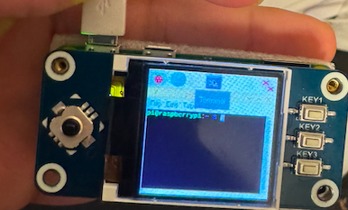
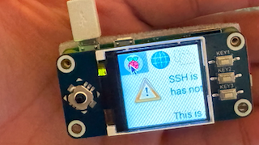
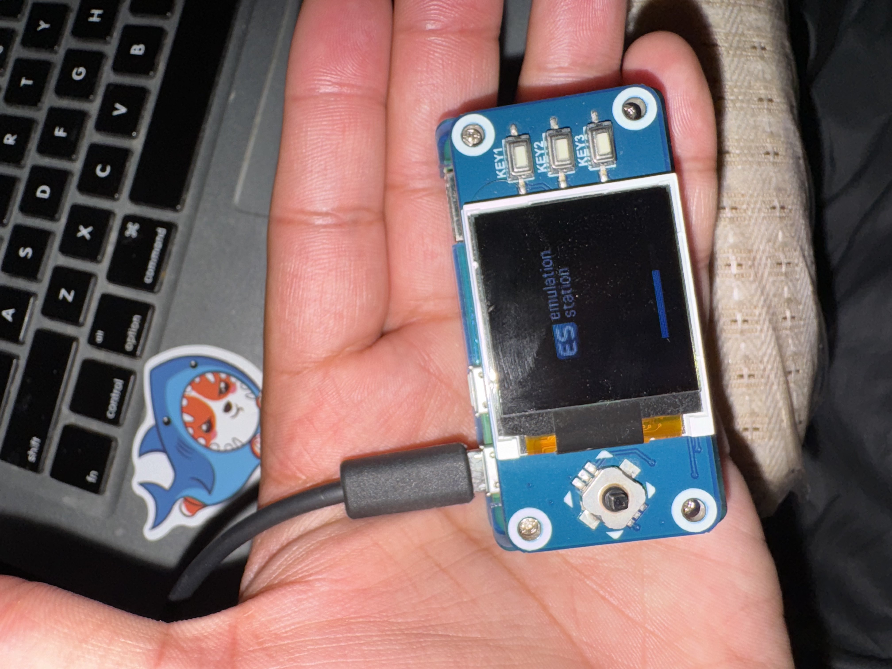
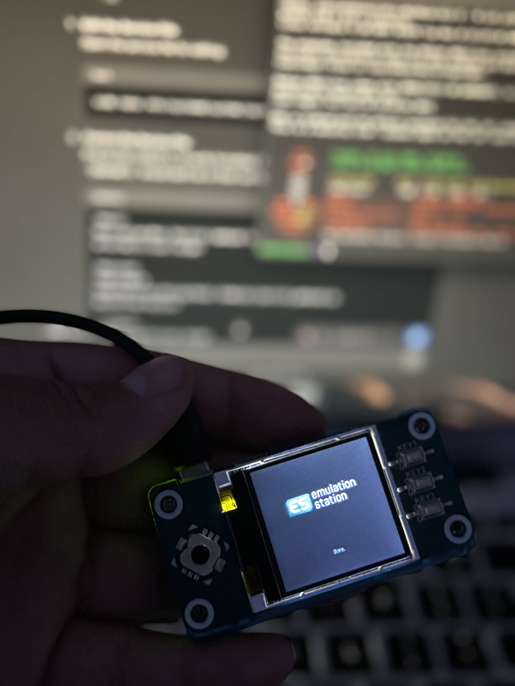
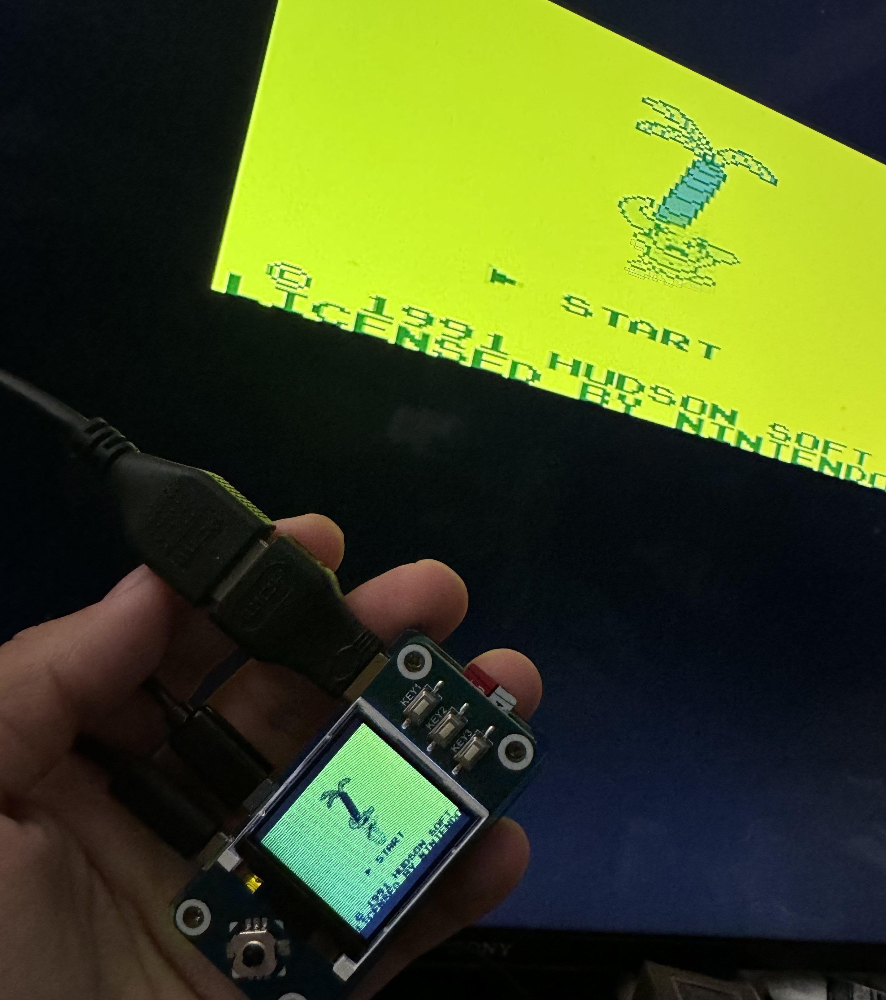

# PI-ZERO-COMPUTE-
Raspberry pi zero 1.4 INCH LCD COMPUTER 
<div style="display: flex; justify-content: space-around;">
    
    
    
    
    
    
</div>
# Raspberry Pi LCD HAT Implementation

This guide provides instructions to set up and use a Waveshare LCD HAT on a Raspberry Pi.

## Table of Contents

1. [Hardware Setup](#hardware-setup)
2. [Software Installation](#software-installation)
3. [Configuration](#configuration)
4. [Running Example Code](#running-example-code)
5. [Troubleshooting](#troubleshooting)
6. [References](#references)

## Hardware Setup

1. Connect the Waveshare LCD HAT to the GPIO pins of your Raspberry Pi.

2. Ensure that the LCD HAT is firmly connected and the Raspberry Pi is powered off before making any connections.

## Software Installation

1. **Update your system:**
    ```bash
    sudo apt-get update
    sudo apt-get upgrade
    ```

2. **Install necessary libraries:**
    ```bash
    sudo apt-get install -y python3-pip
    sudo pip3 install adafruit-circuitpython-pyportal
    ```

## Configuration

1. **Edit `/boot/config.txt` file:**
    ```bash
    sudo nano /boot/config.txt
    ```
   
2. **Add the following lines to configure the display:**
    ```text
    dtparam=spi=on
    dtoverlay=waveshare35a:rotate=270
    ```

3. **Save and exit the file:**
    - Press `CTRL + X`, then `Y`, and press `Enter` to save.

4. **Reboot the Raspberry Pi:**
    ```bash
    sudo reboot
    ```

## Running Example Code

1. **Clone the Waveshare repository:**
    ```bash
    git clone https://github.com/waveshare/LCD-show.git
    cd LCD-show
    ```

2. **Run the example script for your LCD:**
    ```bash
    sudo ./LCD35-show
    ```

3. **Your Raspberry Pi should now display the output on the LCD screen.**

## Troubleshooting

- **Screen not displaying properly:**
    - Check the connections and ensure the HAT is properly seated on the GPIO pins.
    - Verify the configurations in `/boot/config.txt`.

- **Touchscreen not working:**
    - Ensure the `spi` parameter is enabled in the configuration file.
    - Check for any software updates or patches provided by the LCD manufacturer.

## References

- [Waveshare LCD Wiki](https://www.waveshare.com/wiki/Main_Page)
- [Adafruit CircuitPython PyPortal](https://github.com/adafruit/Adafruit_CircuitPython_PyPortal)
- [RetroPie Documentation](https://retropie.org.uk/docs/)

